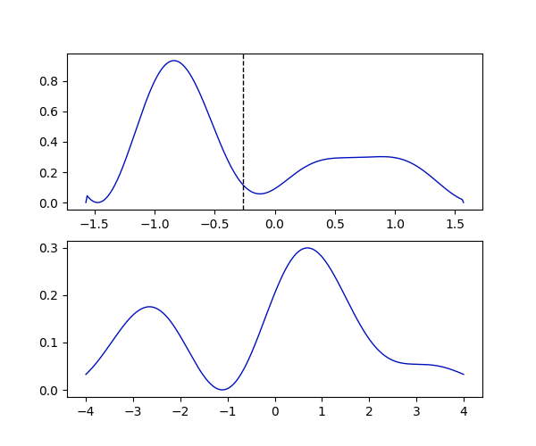

# Pib Lib
A small Python library to compute and visualize the time evolution of the quantum mechanical state of a particle in a one-dimensional box.

## Theoretical Background 
> **_Note:_** _to understand this background, one should be familiar with basic quantum mechanics and the concept of self-adjointness (not to be confused with hermiticity). To get the full understanding of the capabilites of the library, a persual of the literature refered to below is likely to be necessary._

When dicussing the behavior of a quantum mechanical particle in a one-dimensional box, i.e. one a finite interval $[-L/2, L/2]$, one usually imposes Dirichlet boudary conditions in order to quantize the energy eigenstates. That is, for the eigenfunctions $\psi_l$ of the Hamiltonian $H=-\frac{1}{2m}\partial_x^2$, we require $\psi_l(\pm\frac{L}{2})=0$, having in mind the conservation of the probability current. Besides that, these boundary conditions also provide the self-adjointness of the Hamiltonian, which is necessary for the energy eigenstates to be orthogonal and the eigenvalues to be real (and thus for the Hamiltonian to describe a physical concept). It turns out, howerver, that much more general boundary conditions can be allowed that still porvide the probability conservation and the self-adjointness of the resulting Hamiltonian. These boundary conditions, parametrized by two real parameters $\gamma_+$ and $\gamma_-$, are so called *Robin Boundary Conditions* which read: 
$$ \gamma_{\pm}\psi\left(\pm\tfrac{L}{2}\right) \pm\partial_x\psi\left(\pm\tfrac{L}{2}\right) = 0. $$
The aim of this library precisely consisits in simulating the time evolution of states within the domain of a self-adjoint Hamiltonian described by the above boundary conditions. Notice that e.g. Dirichlet boundary conditions correspond to the case where $\gamma_{\pm} \to \infty$. The boundary conditions supported by the library are given by:
- $\gamma_+ = \gamma_-$, refered to as symmetric boundary conditions (mostly based on analytic results)
- $\gamma_+ = -\gamma_-$, refered to as anti-symmetric boundary conditions (based on nummeric results)
- Analytic implementations of the special cases:
  - $\gamma_+ = \gamma_- \to \infty$ (Dirichlet boundary conditions)
  - $\gamma_+ = \gamma_- = 0$ (Neumann boundary conditions)
  - $\gamma_+ = 0$ and $\gamma_- \to \infty$ (Mixed Neumann-Dirichlet boundaries)  

The construction of such states with this library is illustrated in the examples section.

The time evolution of these states can the be visualized in position and (new) momentum space. 'New' hereby referes to a newly constructed self-adjoint opeartor $\hat{p}_R$,  that describes the momentum of a particle on an interval. The necessity for such an operator is extensively discussed in the latter two recommended readings.  

### Further Reading
To get a more indept understanding of the concept of self-adjointness and the necessity of quantum mechanical operators to be self-adjoint to describe physical obersevalbes, consider the following two papers:
- [Self-adjoint extensions of operators and the teaching of quantum mechanics](https://arxiv.org/pdf/quant-ph/0103153.pdf) 
- [From a Particle in a Box to the Uncertainty Relation in a Quantum Dot and to Reflecting Walls for Relativistic Fermions](https://arxiv.org/pdf/1105.0391v1.pdf)


This library was not primarily written to analyze the self-adjointness of the Hamiltonian but of the momentum operator as part of my bachelor thesis. The issues that arise in this context are discussed in:
- [A New Concept for the Momentum of a Quantum Mechanical Particle in a Box](https://arxiv.org/pdf/2012.09596.pdf)
- [[Bachelor Thesis] Self-Adjoint Energy and Momentum Operators with Local Boundary Conditions for a Particle in a Box](http://www.wiese.itp.unibe.ch/theses/wyss_bachelor.pdf)


## Installation
To install the library, [download](https://github.com/Basistransformoptimusprime/Particle_in_a_Box/releases) the repo as zip file and run a pip install in your python environment (supported form version 0.2.0 onwards, earlier versions only presist for documentation purposes):
```
pip install <download-directory>/Particle_in_a_Box-<version>.zip
```
the library can the be accessed via:
```python
>>> import pib_lib
```

## Examples
To construct particle-in-a-box states, the main module needs to be imported via
```python
>>> from pib_lib import particle_in_a_boy as pib
```
and states are then created by:
```python
>>> state = pib.Particle_in_Box_State(boundary_condition, L, m, energy_states, amplitudes, gamma)
```
thereby, `boundary_condition` is a string specifying the boundary conditions according to one of the supported cases specified above. `L` corresponds to the length of the interval and `m` to the mass of the particle (both in natural units). `energy_states` is a list of integers which correspond to the energy quantum numbers of the states we want to superimpose to get the desired state with the respective amplitudes given by the list entries of `amplitudes`. The parameter `gamma` is only required when `boundary_conditions` is set to `symmetric` or `anti-symmetric`. Thereby `gamma` referes to $\gamma_+ = \gamma_-$ in the symmetric and to $\gamma_+ = -\gamma_-$ in the anti-symmetric case.

A full example, also including a visualization of the state via the `update_plot.py` module using matplotlib could look like:
```python
from pib_lib import particle_in_a_box as pib
from pib_lib import update_plot as up
import numpy as np
from matplotlib import pyplot as plt

L = np.pi
m = 1
states = [1,2,3]
amps = [1,1,1]
case = "anti_symmetric"
gamma = 10

state = pib.Particle_in_Box_State(case, L, m, states, amps, gamma)

fig = plt.figure(figsize=(6,5))
gs = fig.add_gridspec(nrows=2, ncols=1)
pos_ax = fig.add_subplot(gs[0,0])
momentum_ax = fig.add_subplot(gs[1,0])

position_plot = up.position_space_plot(state, fig, pos_ax)
momentum_plot = up.momentum_space_plot(state, fig, momentum_ax)
plots = up.Update_Plot_Collection(fig, position_plot, momentum_plot)

plots.set_t(1)
plots.plot()
```


A more thorough explanation of the library can soon be found in the [demo notebook](Notebooks/demo.ipynb).